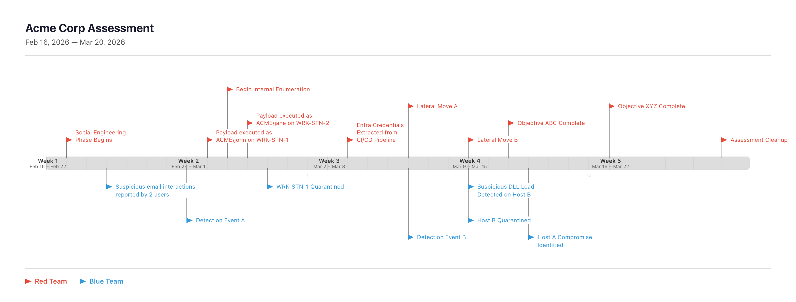

# Red Team Timeline

A visual timeline tool for planning and documenting red team / blue team security assessments. Built with React, TypeScript, and Vite.

### Example

<video src=".demo/demo.mp4" controls width="100%"></video>

### Exported PNG




## Quick Start

```bash
docker compose up -d
```

Open [http://localhost:8080/index.html](http://localhost:8080/index.html) in your browser.

To stop:

```bash
docker compose down
```

## Development
```bash
npm install
npm run dev
```

## Tech Stack
- React 19 + TypeScript
- Vite
- date-fns
- html-to-image (PNG export)
- Docker + Nginx (production)
